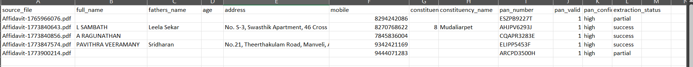
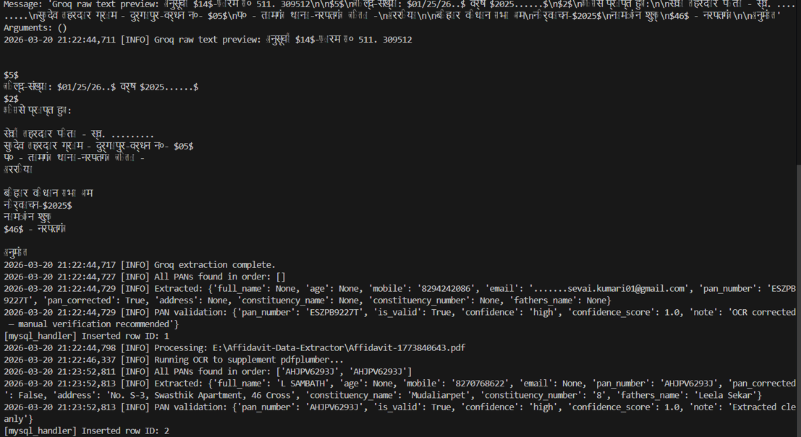
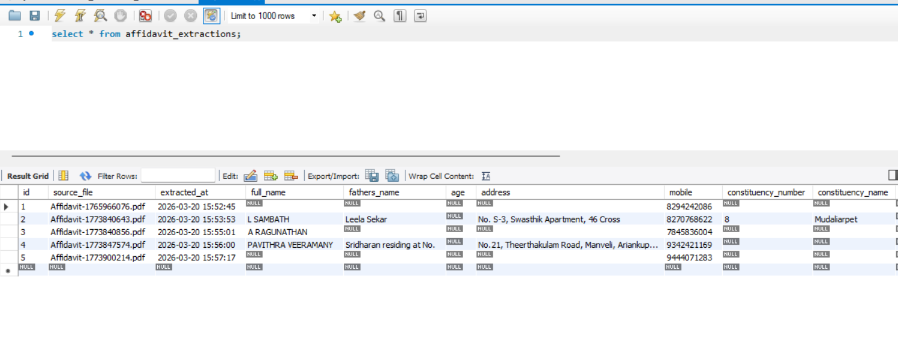
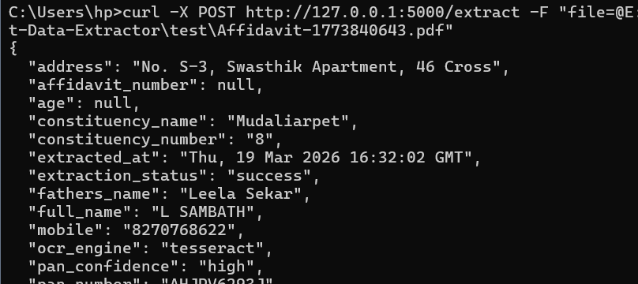

# Affidavit Data Extractor

An intelligent document processing system that automatically extracts key information 
from Electoral Commission Affidavit PDF documents using text extraction, OCR, and 
AI-powered analysis.

## Table of Contents

- [Project Overview](#project-overview)
- [Key Features](#key-features)
- [Project Architecture](#project-architecture)
- [Prerequisites](#prerequisites)
- [Setup Instructions](#setup-instructions)
- [Environment Configuration](#environment-configuration)
- [Database Configuration](#database-configuration)
- [How to Run the Project](#how-to-run-the-project)
- [API Endpoints](#api-endpoints)
- [Sample Output](#sample-output)
- [Field Extraction Details](#field-extraction-details)
- [Known Limitations](#known-limitations)
- [Future Enhancements](#future-enhancements)
- [Project Structure](#project-structure)

---

## Project Overview

The **Affidavit Data Extractor** automates extraction of critical information from 
Electoral Commission of India (ECI) affidavits (Form 26). It processes PDF documents 
and extracts:

- **Personal Information**: Full name, father's/spouse's name, age, address, mobile
- **Election Information**: Constituency name and number
- **Financial Information**: PAN (Permanent Account Number) with validation and 
  confidence scoring
- **Metadata**: OCR engine used, extraction status, timestamp

The system uses a three-layer extraction approach:
1. **pdfplumber** — Direct PDF text extraction (fast, always runs)
2. **Tesseract OCR** — Optical character recognition (always runs, supplements layer 1)
3. **Groq API** — AI-powered fallback (only when PAN not found after layers 1+2)

All extracted data is stored in MySQL and exported to CSV.

---

## Key Features

- **Multi-Engine Extraction**: pdfplumber + Tesseract + Groq for maximum coverage
- **PAN Validation**: Format validation with confidence scoring (0.0 - 1.0)
- **OCR Correction**: Auto-corrects common OCR misreads in PAN numbers
- **Transliteration**: Converts Tamil/Hindi text to English for processing
- **MySQL Storage**: Persistent storage with duplicate prevention
- **CSV Export**: Automatic export after each batch run
- **REST API**: Flask-based HTTP endpoint for single file processing
- **Logging**: Detailed daily log files for debugging and audit

---

## Project Architecture

- **main.py**: CLI entry point for batch processing
- **api/app.py**: Flask REST API server
- **requirements.txt**: Python dependencies

- **extractor/**
  - `pdf_extractor.py`: pdfplumber text extraction + name extraction
  - `ocr_extractor.py`: Tesseract + Groq OCR engines
  - `field_extractor.py`: Regex-based field parsing
  - `pan_validator.py`: PAN validation + confidence scoring

- **database/**
  - `mysql_handler.py`: MySQL connection, DDL, queries
  - `schema.py`: Record schema & transformation

- **utils/**
  - `logger.py`: Logging configuration
  - `csv_writer.py`: CSV export
  - `transliterate.py`: Tamil/Hindi transliteration

- **logs/**: Auto-created daily log files
- **.env**: Environment config (not included in repository)

---

## Prerequisites

### System Requirements
- **Python**: 3.8 or higher
- **MySQL**: 5.7 or higher
- **Tesseract OCR**: Required for scanned PDF support

### Tesseract Language Packs Required
- `eng` (English)
- `tam` (Tamil)
- `hin` (Hindi)

---

## Setup Instructions

### 1. Clone the Repository

```bash
git clone <repository-url>
cd Affidavit-Data-Extractor
```

### 2. Create a Virtual Environment

```bash
python -m venv .venv

# Windows:
.\.venv\Scripts\Activate.ps1

# macOS/Linux:
source .venv/bin/activate
```

### 3. Install Python Dependencies

```bash
pip install -r requirements.txt
```

### 4. Install Tesseract OCR

**Windows:**
1. Download from: https://github.com/UB-Mannheim/tesseract/wiki
2. Install (recommended path: `C:\Program Files\Tesseract-OCR`)
3. Add to system PATH

**macOS:**
```bash
brew install tesseract
```

**Linux:**
```bash
sudo apt-get install tesseract-ocr
sudo apt-get install tesseract-ocr-tam tesseract-ocr-hin
```

---

## Environment Configuration

Create a `.env` file in the project root:

```env
# MySQL Configuration
MYSQL_HOST=localhost
MYSQL_USER=root
MYSQL_PASSWORD=your_password
MYSQL_DATABASE=affidavit_db

# Groq API Key (for AI fallback OCR)
GROQ_API_KEY=your_groq_api_key_here
```

Get a free Groq API key at: https://console.groq.com

---

## Database Configuration

The database is created automatically on first run. No manual setup required.

### Schema

```sql
CREATE TABLE affidavit_extractions (
    id                  INT AUTO_INCREMENT PRIMARY KEY,
    source_file         VARCHAR(255),
    extracted_at        DATETIME,
    full_name           VARCHAR(255),
    fathers_name        VARCHAR(255),
    age                 INT,
    address             TEXT,
    mobile              VARCHAR(20),
    constituency_number VARCHAR(10),
    constituency_name   VARCHAR(255),
    affidavit_number    VARCHAR(50),
    pan_number          VARCHAR(10),
    pan_valid           TINYINT(1),
    pan_confidence      VARCHAR(10),
    ocr_engine          VARCHAR(50),
    extraction_status   VARCHAR(20),
    created_at          TIMESTAMP DEFAULT CURRENT_TIMESTAMP,
    UNIQUE KEY uq_source_file (source_file)
);
```

---

## How to Run the Project

### Option 1: Batch Processing

Place PDF files in the project root directory and run:

```bash
python main.py
```

**Expected Output:**
```
[INFO] Found 5 PDFs
[INFO] Processing: Affidavit-1773840643.pdf
[INFO] Running OCR to supplement pdfplumber...
[INFO] Extracted: {'full_name': 'L SAMBATH', 'pan_number': 'BQMPS0009L', ...}
[INFO] PAN validation: {'pan_number': 'BQMPS0009L', 'confidence': 'high', ...}
[mysql_handler] Inserted row ID: 1
[INFO] CSV written with 5 records.
```

**Generated Files:**
- `extracted_YYYYMMDD_HHMMSS.csv` — extracted records
- `logs/YYYYMMDD.log` — processing log

### Option 2: REST API

```bash
python api/app.py
```

Send a PDF via curl:
```bash
curl -X POST http://127.0.0.1:5000/extract \
  -F "file=@affidavit.pdf"
```

---

## API Endpoints

### POST /extract

**Request:** `multipart/form-data` with key `file`

**Success Response (200):**
```json
{
  "source_file": "affidavit.pdf",
  "full_name": "L SAMBATH",
  "fathers_name": "Leela Sekar",
  "age": 46,
  "address": "No. S-3, Swasthik Apartment, Mudaliarpet",
  "mobile": "9443287521",
  "constituency_number": "18",
  "constituency_name": "Mudaliarpet",
  "pan_number": "BQMPS0009L",
  "pan_valid": 1,
  "pan_confidence": "high",
  "ocr_engine": "tesseract",
  "extraction_status": "success"
}
```

**Error Responses:**
```json
{ "error": "No file uploaded" }                  
{ "error": "Only PDF files accepted" }             
{ "error": "No PAN found, record not saved" }      
```

---

## Sample Output

### CSV Sample


### Field Extraction



### SQL Database Sample



### API working



### Confidence Scoring (0.0 - 1.0)

| Check | Score |
|-------|-------|
| Valid AAAAA9999A format | +0.4 |
| 4th character is valid entity type (P/C/H/F/A/T/B) | +0.2 |
| First 3 characters are letters | +0.1 |
| 5th character is a letter | +0.1 |
| Digits 5-8 are actual digits | +0.2 |

---

## Limitations

### 1. PAN Confidence Score
The confidence score is based purely on **regex pattern analysis** — it cannot 
verify whether the PAN actually exists or belongs to the candidate. A score 
of 1.0 means the format is perfect, not that the PAN is correct. 
The only true verification would require the Income Tax Department's PAN 
verification API (requires business registration).

### 2. Handwritten PANs
Bihar and some Hindi affidavits contain handwritten PAN numbers. OCR 
(including Groq AI) may misread handwritten characters. These are flagged 
with `confidence: "medium"` and note `"OCR corrected — manual verification 
recommended"`. The extracted PAN may have 1-2 incorrect characters.

### 3. Tamil PDF Table Extraction
pdfplumber cannot correctly read Tamil-language PDF tables. Tesseract OCR 
is used as a supplement, but may pick up the spouse's PAN instead of the 
candidate's PAN in some cases due to table structure ambiguity.

### 4. Incomplete Field Extraction
Not all fields are extracted for every document:
- **Age**: May be missed if written in regional language format
- **Address**: Only extracted if "residing at" or "resident of" phrase present
- **Constituency**: Only extracted from English text portions
- **Father's name**: May be missed for  affidavits

### 5. Non-ECI Documents
Documents that are not Form 26 ECI affidavits (nomination receipts, 
Bihar state forms, etc.) do not follow the expected format and may 
not have extractable PANs. These are skipped with a warning.

### 6. Groq AI Limitations
Even with Groq AI as fallback, extraction may fail if:
- The document is very low quality or blurred
- The PAN is entirely handwritten in non-standard style
- Groq API rate limits are reached (free tier: limited requests/day)
- The document language is not supported by the model

### 8. Language Support
The project currently supports: 
- English
- Tamil
- Hindi
These languages are currently installed with the tesseractpackage.

---

## Future Enhancements

- **PAN Verification API**: Integrate with Income Tax Department's official 
  PAN verification API to confirm PAN validity and ownership rather than 
  relying on format-only confidence scoring

- **Improved Candidate PAN Detection**: Better table structure analysis to 
  reliably distinguish candidate PAN from spouse/dependent PANs in 
  Tamil-language affidavits

- **Age & Constituency Extraction**: Improve regex patterns to extract age 
  and constituency from Tamil and Hindi language sections

- **Batch API Endpoint**: Allow multiple PDFs to be uploaded via single 
  API call with async processing

- **Web Dashboard**: Simple UI to upload PDFs, view extracted records, 
  and export data without command line

- **Docker Support**: Containerized deployment with MySQL included for 
  zero-setup installation

- **Financial Disclosure Parsing**: Extract asset declarations, bank 
  accounts, and liabilities from the financial disclosure sections


---

## Project Structure Summary

| File | Purpose |
|------|---------|
| `main.py` | Batch PDF processing |
| `api/app.py` | Flask REST API |
| `extractor/pdf_extractor.py` | pdfplumber extraction |
| `extractor/ocr_extractor.py` | Tesseract + Groq OCR |
| `extractor/field_extractor.py` | Regex field parsing |
| `extractor/pan_validator.py` | PAN validation + scoring |
| `database/mysql_handler.py` | MySQL operations |
| `database/schema.py` | Record schema |
| `utils/logger.py` | Logging |
| `utils/csv_writer.py` | CSV export |
| `utils/transliterate.py` | Transliteration |

---
